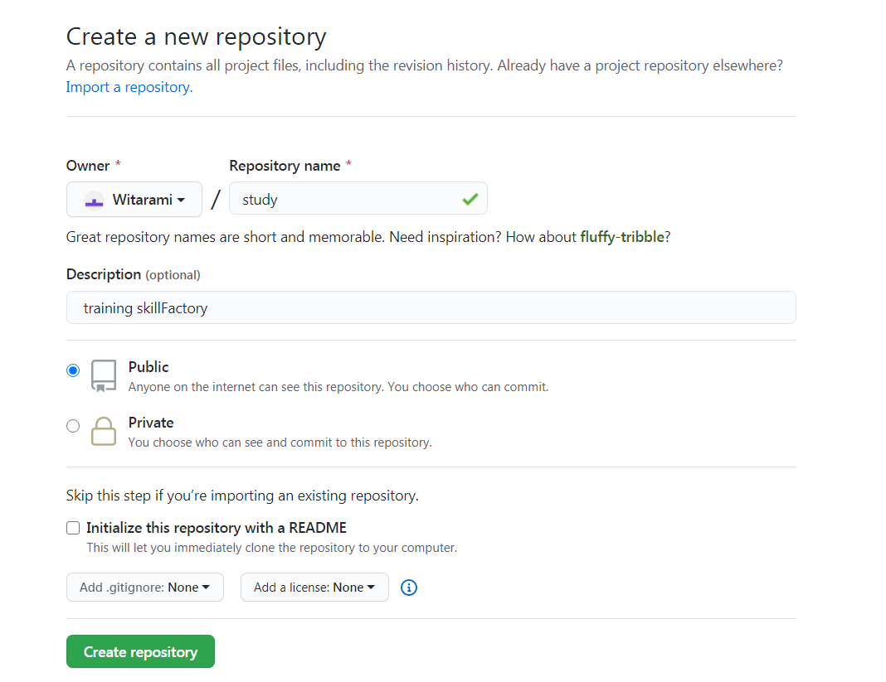

## Создать новый репозиторий

   * В правом верхнем углу, рядом с вашим аватаром или идентификатором, нажмите **+** и затем выберите **Новый репозиторий**.
   * Присвойте репозиторию имя.
   * Напишите краткое описание.
   * В типах доступами выбирете Public

Нажмите **Create repository**
