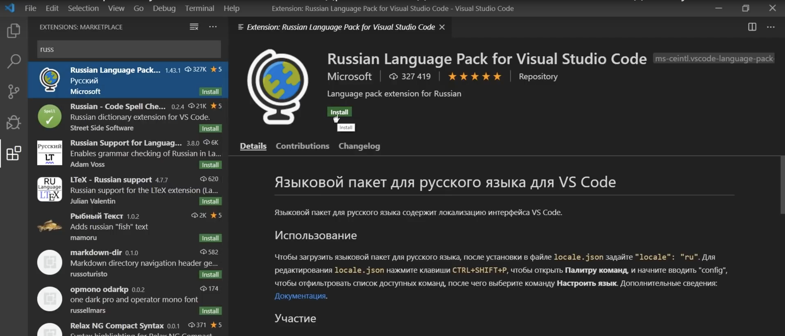

[< к содержанию](./readme.md)

# Установка и настройка Visual Studio Code

* Установка программы

   -  Переходим на сайт code.visualstudio.com, секция Download,  скачиваем программу. 
   - Программа скачана, запускаем инсталлятор и следуем инструкциям: принимаем, добавляем все галочки, далее, ждем пока программа установится на наш ПК.

* Установка языка
    
   - выбираем иконку расширений
   - в поле поиска начинаем писать russian
   
   - устанавливаем плагин кнопкой instal 

   - Выбираем вкладку View/Command Palette, набираем в поиске display language, меняем язык и перезагружаем программу.

* Настраиваем автосохранение

   - Выбираем вкладку ***файл***/***параметры***
   - Auto Save выставляем на ***afterDelay***
   - задержку на 2000 мсек

* Подготовка к работе
  
   - создаем новый проект, нажимаем ***открыть папку*** и создаем новый каталог
   - в каталоге создаем файл [***.gitignore***](./.gitignore)
   - нажимаем вкладку ***Терминал/Создать терминал***

   ---

   [<назад](./sign_up.md) | [вперёд>](./repository.md)